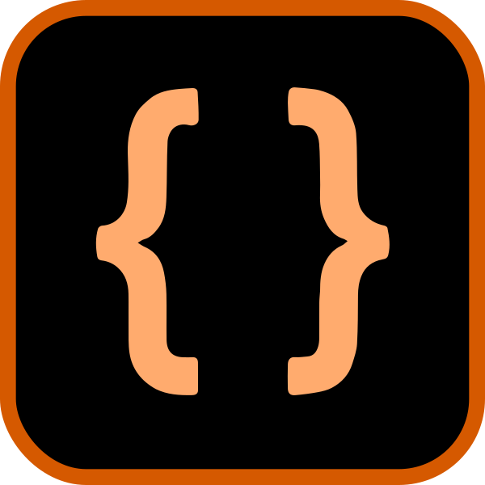

# Jakub Korytko portfolio

This is my personal portfolio website, built with Next.js.  
It showcases my projects, skills, and experience in a clean and modern design.

Check it out ~~at [korytko.dev](https://korytko.dev)~~ not yet, but soon!

## Prerequisites

Before you start, make sure you have the following installed:

- [Node.js](https://nodejs.org/) (version 22.16.0 or later)
- [pnpm](https://pnpm.io/) (version 9.15.3 or later)

## Run locally

To run this project locally, follow these steps:

1. Clone the repository:

   ```bash
    git clone https://github.com/JakubKorytko/portfolio.git
    cd portfolio
   ```

2. Install the dependencies:

   ```bash
   pnpm install
   ```

3. Start the development server:

   ```bash
   pnpm dev
   ```

4. Open your browser and go to `http://localhost:3000` to see the website in action.
